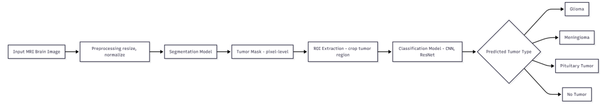
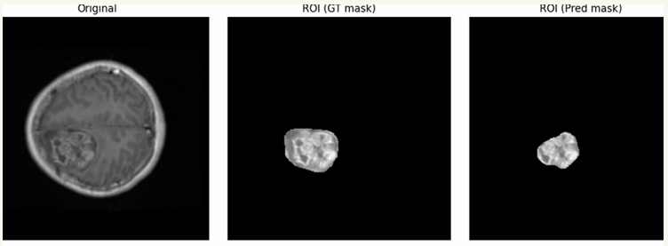
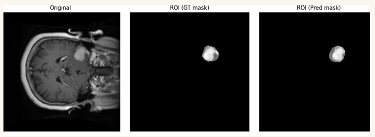

# Mediscan AI: Automated Brain Tumor Analysis
## A Two-Stage Deep Learning Pipeline for MRI Segmentation and Classification

## 📌 Project Overview
Mediscan AI is an intelligent medical imaging system developed to assist in the early diagnosis of brain tumors. This project implements a sophisticated two-stage pipeline: a U-Net architecture for pixel-level segmentation to localize the tumor, followed by a CNN to classify the detected tumor into specific categories.
By isolating the Region of Interest (ROI) from the segmented mask, the system effectively reduces background noise and focuses the classification model on the most relevant diagnostic features.

## 🚀 Key Features
**Standardized Preprocessing:** Full pipeline including grayscale conversion, intensity normalization (0 to 1), resizing to 256 × 256, and noise reduction via Gaussian filtering.
**Pixel-Level Segmentation:** Utilizes a U-Net architecture with symmetric encoder-decoder structures and skip connections to preserve fine spatial details.
**Automated ROI Extraction:** Isolates tumor regions from original MRI slices using predicted segmentation masks to enhance classification accuracy.
**Multi-Class Classification:** Categorizes tumors into three primary types: Glioma, Meningioma, and Pituitary Tumor.
**Comprehensive Evaluation:** Independent performance monitoring for segmentation (using Dice Coefficient and IoU) and classification (using Accuracy and Confusion Matrices).

## 🧠 Model Architecture & Methodology

The project validates an end-to-end framework through a modular strategy:
**Segmentation (U-Net):** Extracts high-level semantic information while maintaining boundary precision.
**ROI Generation:** Compares classification performance using full images vs. ground-truth ROIs vs. predicted ROIs to analyze how segmentation quality affects diagnostic results.
**Classification (CNN):** A high-performance classifier trained on localized tumor features.

## 📂 Dataset
The study uses an annotated Brain Tumor MRI Dataset.
**Source:** Available on Kaggle.
**Content:** MRI slices paired with ground-truth segmentation masks.
**Note:** To protect data privacy and comply with repository size limits, the raw dataset is not included in this repository.

## Results (Pilot Study)
### Visual Validation: The U-Net model demonstrated successful pixel-level localization, effectively distinguishing tumor tissue from healthy brain structures.

## 🗺️ Project Roadmap (2-Semester Research)
### Phase 1: Foundation (Semester 1 - Completed)
- Established a functional Phase 1 system with a pilot dataset.
- Implemented core U-Net and CNN architectures.
- Validated the feasibility of the segmentation-classification pipeline.

### Phase 2: Optimization (Semester 2 - In Progress)
- **Data Augmentation:** Implementing elastic deformations and intensity shifts to improve robustness.
- **Advanced Metrics:** Transitioning to Hausdorff Distance (HD95) for stricter boundary evaluation.
- **Architectural Upgrades:** Exploring Attention U-Net and Residual U-Net enhancements.
- **Backbone Optimization:** Replacing the SimpleCNN baseline with ResNet or EfficientNet.

## 👥 Authors
- **Mudar Shawakh** – Software Engineering Student.
- **İbrahim Gökdemir** – Software Engineering Student.
- **Supervisor:** Dr. Cumali Türkmenoğlu.
